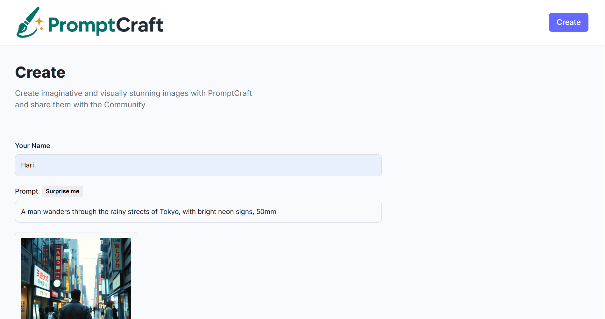
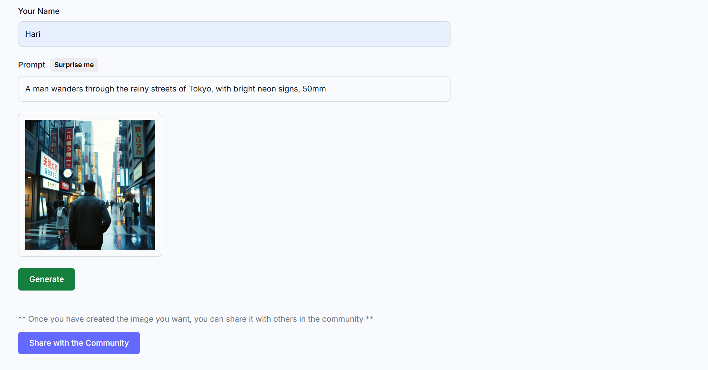

# PromptCraft

  

Generate images from text prompts and share them with a community showcase.

## Screenshots

### Home
Browse and search community posts.

### Generate
Create imaginative images from a text prompt.

### Share
Share your creation with the community.

## Built with
- HTML, CSS, JavaScript
- React.js, Vite, Tailwind CSS
- Node.js, Express
- MongoDB, Mongoose
- Cloudinary
- Hugging Face Inference

## Features
- Create images from text prompts
- Share creations to a community gallery
- Browse and search community posts

## Deploy

### Netlify (frontend)
- Base directory: `client`
- Build: `npm run build`
- Publish: `dist`
- Env: `VITE_API_URL` = your Render backend URL

### Render (backend)
- Root directory: `server`
- Build command: `npm run build` (no-op; Express needs no compile step)
- Start command: `npm start`
- Env vars: `MONGODB_URL`, `HF_TOKEN`, `HF_MODEL`, `CLOUDINARY_*`, `PORT`, `FRONTEND_URL` (your Netlify URL)
